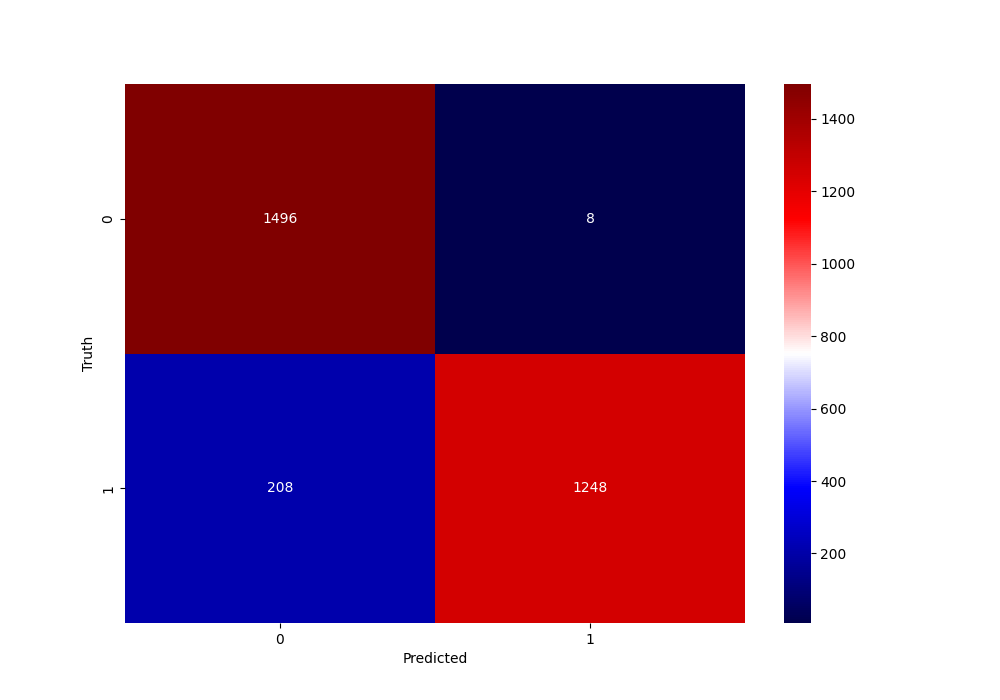

# British Airways Data Science Project
By **Joel Sud**
## Table of Contents:
- [Description](#description)
    - [Findings](#findings)
- [Installation Instructions](#installation_instructions)
- [Usage Instructions](#usage_instructions)
- [File Structure](#file_structure)
    - [File Description](#understanding-the-files)
- [Project Documentation:](#project-documentation)

## Description: 
A British Airways Python Data Science Project from Forage which uses interactive notebooks to fulfil two aims:

1. Web scraping and Data Analysis (topic modeling and sentiment analysis) on reviews of British Airways on Skytrax Website.

2. Use predictive modeling (Random Forest Classifier) to predict customer booking completion from historic customer booking data and features. This model's prediction accuracy was also evaluated and important featured identified. 

### Findings:

Some of the visuals produced from the analysis and modeling are as shown:

**Word Cloud**

**Sentiment Analysis**

**Confusion Plot**

**Feature Importances**

**Cross-Validation Accuracy Evaluation**

## Installation Instructions:
1. **Download and clone repository:**
- copy the repository URL by clicking '*<> Code*' above the list of files in GitHub Repo. Then copy and paste the '*HTTPS*' URL:
- in your CLI go to the location where you wish to clone your directory.
- Type the following '***git clone***' command with the '*HTTPS*' URL:

***
git clone https://github.com/joelsud18/British_Airways_Data_Science_Project.git***

- Press 'Enter'.

2. **Ensure there is the '*environment.yaml*' file.** This will be used to clone the conda environment with all the packages and versions needed to run the code in this repository. Using conda on the CLI on your machine write the following command:

***
conda env create -f environment.yml***

    
- you can add the ***--name*** flag to give a name to this environment.

## Usage Instructions

1. Ensure the repository has been cloned and all the files in the [File Structure](#file_structure) are present.
2. Review *review_insights.pptx* and *booking_insights.pptx* to get an overview of the insights gained from the reviews analysis and bookings preductive modeling.
3. Run and review the *data_scraping.ipynb* notebook to scrape the web reviews for british airways.
4. Run and review the *data_analysis.ipynb* to explore the data cleaning, EDA, topic modeling and sentiment analysis on the scraped reviews.
5. Run and review the *predictive_modeling.ipynb* to explore the EDA and data modeling process which involved using a Random Forest Classifier model to predict whether a customer is likely to complete a booking, as well as the evaluation and feature importance analysis of the model.
6. Review the future work sections in the notebook conclusions and get in touch with any further analysis and modeling or suggestions!

## File Structure:
- data
  - BA_reviews.csv
  - customer_booking.csv
- presentations
  - booking_insights.pptx
  - review_insights.pptx
- python_scripts
  - data_transformation.py
  - data_visualisation.py
- visuals
  - box_plot.png
  - compound_score.png
  - confusion_plot_1.png
  - confusion_plot_2.png
  - feature_importances.png
  - lda.html
  - sentiment_analysis.png
  - sentiment_score.png
  - wordcloud_image.png
- data_analysis.ipynb
- data_scraping.ipynb
- predictive_modeling.ipynb
- environment.yml

### Understanding the Files:
- **data**: This folder contains the raw data in .csv format.
- **data_transformation.py**: This script defines the class methods used for data cleaning and analysis transformations to the dataframe.
- **data_visualisation.py**: This script defines the class methods used for visualising data in the dataframe.
- **visuals**: This folder contains data visualisation.
- **lda.html**: This is a html interactive visualisation of the LDA topic modelling.
- **data_analysis.ipynb**: This interactive notebook contains the data cleaning and analysis of the scraped customer reviews including data cleaning, word cloud EDA, topic modelling and sentiment analysis.
- **data_scraping.ipynb**: This interactive notebook scrapes data using the BeautifulSoup library from a website and loads it into a .csv file.
- **predictive_modeling.ipynb**: This interactive model uses the Random Forest Classifier model to predict customer booking completion from booking features.
- **review_insights.pptx**: This is a powerpoint presentation showcasing the key insights and visualisations from the *data_analysis.ipynb* analysis.
- **booking_insights.pptx**: This is a powerpoint presentation showcasing the key insights and visualisations from the *predictive_modeling.ipynb*.
